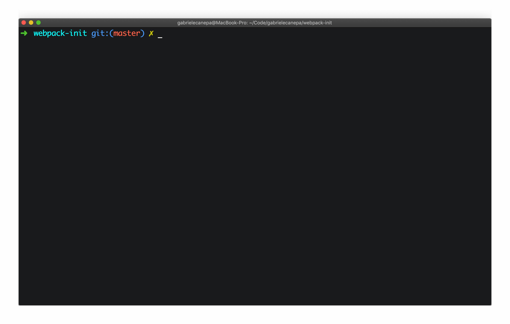
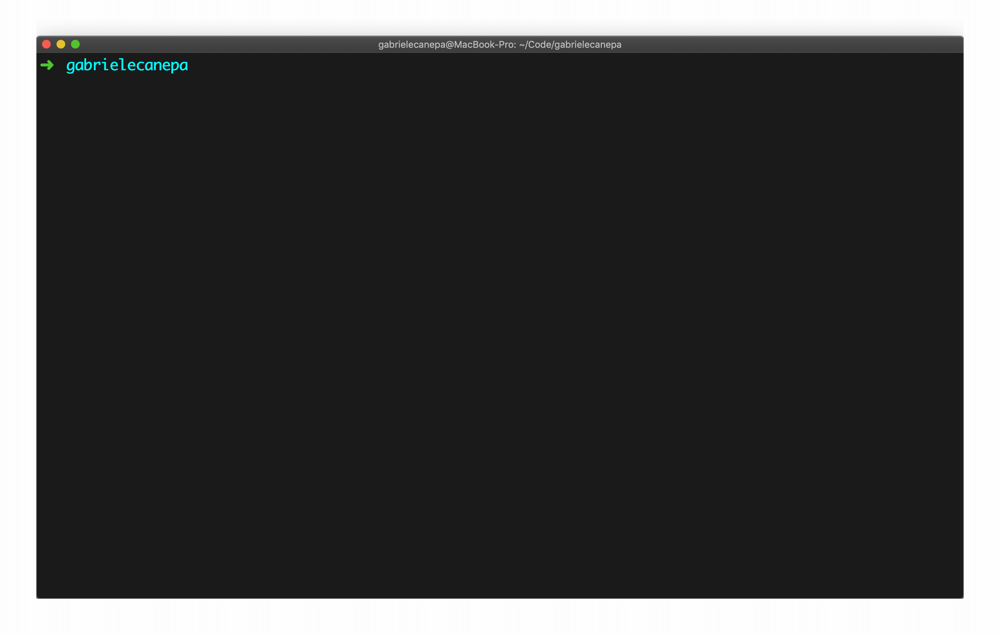
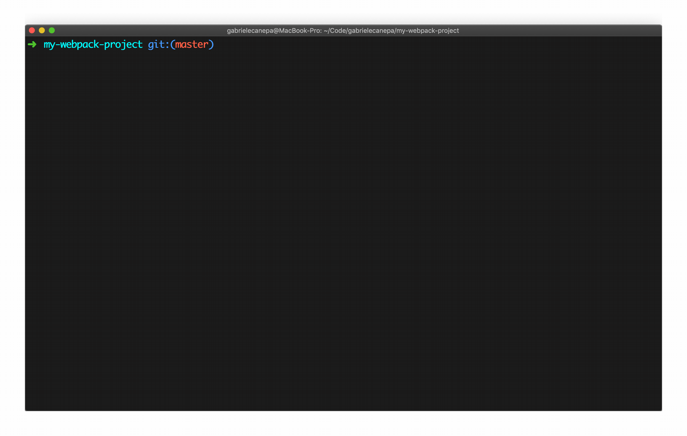

# Webpack Init

Generate a preconfigured webpack boilerplate from your shell - ideal for quick prototypes ⚡️

## Usage

Clone the repository on your computer. You must have [Node.js](https://nodejs.org) (> v4) and [Yarn](https://yarnpkg.com/lang/en/docs/install) installed:

```sh
git clone git@github.com:gabrielecanepa/webpack-init
# or
gh repo clone gabrielecanepa/webpack-init

cd webpack-init
```

Run the `.webpack-init` script once. The executable will be copied into your root folder and an alias will be set in your first available profile:

```sh
sh .webpack-init
```



After restarting the terminal, you will be able to run `webpack:init` from any place on your computer.

The command initializes a new repository with a ready-to-use [webpack boilerplate](https://github.com/gabrielecanepa/webpack-boilerplate) with the following configuration:

-   [Yarn](https://yarnpkg.com)
-   [webpack](https://webpack.js.org)
-   [Babel](https://babeljs.io) with [latest preset](https://babeljs.io/docs/en/babel-preset-env)
-   [ESLint](https://eslint.org) with [Airbnb configuration](https://www.npmjs.com/package/eslint-config-airbnb-base) base
-   [Sass](http://sass-lang.com) with [stylelint](https://stylelint.io) and modules import to enjoy hot reloading
-   [GitHub Pages](https://www.npmjs.com/package/gh-pages) for easy deployment



Make sure you have `./node_modules/.bin` in your `$PATH`. This way you can run your server with:

```sh
webpack-dev-server
```



### Scripts

To speed up the development process, some scripts have been defined in `package.json`.

To start a local server on port `8080`:

```bash
yarn start
```

To lint all your JavaScript and CSS/SCSS files:

```bash
yarn lint
```

To build your static files:

```bash
yarn build
```

To push the built files to the `gh-pages` branch and deploy to [GitHub Pages](https://pages.github.com):

```bash
yarn deploy
```
